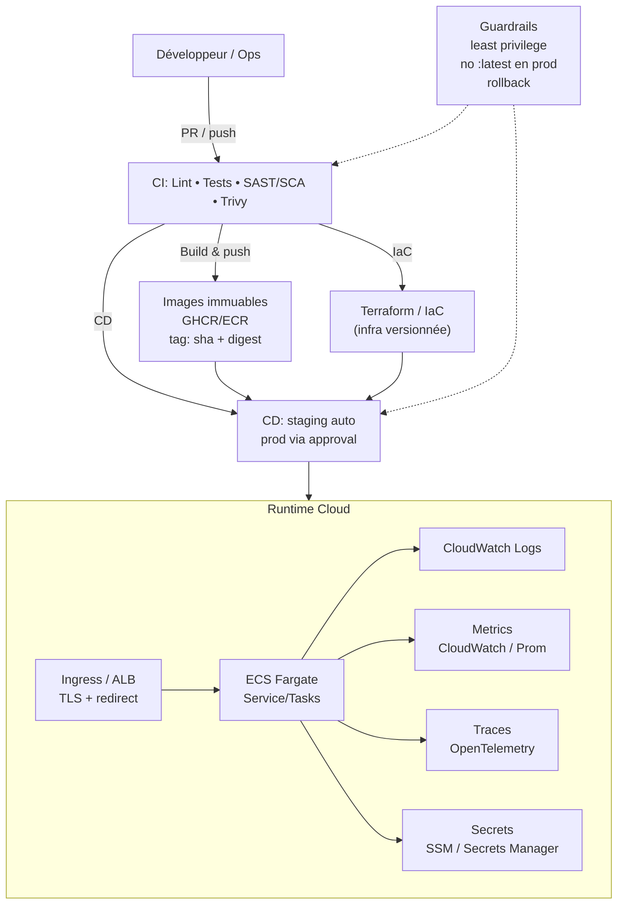
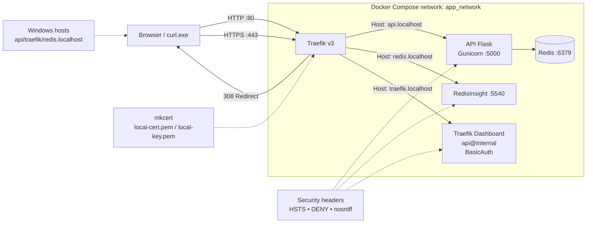

# 🚀 docker-api-lab — DevOps & Cloud-Native Playground

[](https://github.com/Astroboy-ML/docker-api-lab/actions/workflows/ci-cd.yml)


> Projet showcase pour démontrer un workflow complet **Dev + Sec + Ops** : API Flask, Redis, Docker multi-stage, environnement local HTTPS avec Traefik, CI/CD GitHub Actions, sécurité automatisée, déploiement AWS ECS Fargate et observabilité CloudWatch.

---

## 🎯 La cible que je vise

Je construis ce projet comme une **“prod-like”**  :

- **Platform Engineer / DevOps Engineer (Cloud-Native)**  
- focus : **containers**, **CI/CD**, **sécurité**, **déploiement cloud**, **observabilité**, **IaC**

L’objectif : **construire**, **sécuriser**, **livrer** et **opérer** une application de bout en bout.

### 🧭 Vision cible (plateforme) — schéma Mermaid



---

## 🧭 Sommaire

- [Highlights rapides](#-highlights-rapides)
- [Architecture & flux](#-architecture--flux)
- [Schéma de l’environnement local](#-schéma-de-lenvironnement-local)
- [Stack & structure](#-stack--structure)
- [Démarrer en local](#-démarrer-en-local)
- [Reverse proxy local (Traefik) + HTTPS](#-reverse-proxy-local-traefik--https)
- [Qualité & sécurité](#-qualité--sécurité)
- [Conteneurisation](#-conteneurisation)
- [Pipeline CI/CD](#-pipeline-cicd)
- [Déploiement AWS ECS](#-déploiement-aws-ecs)
- [Réseau, Load Balancing & HTTPS](#-réseau-load-balancing--https)
- [Opérations & troubleshooting](#-opérations--troubleshooting)
- [API](#-api)
- [Roadmap](#-roadmap)
- [Auteur](#-auteur)

---

## ⚡ Highlights rapides

| Thème | Description |
|-------|-------------|
| API & Cache | Flask + Gunicorn, Redis pour cache et rate limiting |
| Local | docker-compose (Traefik + API + Redis + RedisInsight) |
| Qualité | flake8, pytest + coverage, Bandit, pip-audit, Trivy (FS & image) |
| CI/CD | GitHub Actions multi-jobs → build/push GHCR + ECR → déploiement ECS |
| Cloud | ECS Fargate `awsvpc`, ALB, logs CloudWatch |
| Sécurité | Dashboard Traefik protégé, HTTPS local, headers de sécurité |

---

## 🏗 Architecture & flux

### Cloud (prod) — vue simple
```text
git push
  │
  ▼
GitHub Actions (lint → tests → scans → build/push → deploy ECS)
  │
  ▼
AWS:
- ECR (image)
- ECS Fargate (tasks)
- CloudWatch Logs
- ALB (TLS + redirect HTTP->HTTPS)
```

---

## 🧪 Schéma de l’environnement local



---

## 🧱 Stack & structure

| Domaine | Choix |
|---------|-------|
| Langage | Python 3.12 |
| Framework | Flask |
| Webserver prod | Gunicorn |
| Cache | Redis 7 |
| Reverse proxy local | Traefik v3 (HTTPS + BasicAuth + security headers) |
| Orchestration local | docker-compose |
| Build | Docker multi-stage |
| CI/CD | GitHub Actions |
| Cloud | AWS ECS Fargate, Amazon ECR, CloudWatch Logs |
| Réseau & Entrée | ALB HTTPS (ACM) + target group ECS |

```
docker-api-lab/
├── app/                # Code Flask + routes Redis
├── tests/              # pytest
├── Dockerfile          # multi-stage builder → runtime
├── docker-compose.yml  # Traefik + API + Redis + RedisInsight
├── certs/              # certs mkcert (local only, non commit)
├── traefik/dynamic/    # tls.yml (local only)
├── Makefile            # helpers build/run/logs
├── requirements.txt
└── .github/workflows/ci-cd.yml
```

---

## 🛠 Démarrer en local

### Prérequis
- Docker / Docker Compose v2
- (Optionnel) Python 3.12 si exécution hors Docker

### Setup rapide (compose)
```bash
docker compose up --build -d
docker compose logs -f api
docker compose down -v
```

---

## 🔀 Reverse proxy local (Traefik) + HTTPS

### Local domains
- API: `https://api.localhost/health`
- Dashboard Traefik: `https://traefik.localhost/dashboard/`
- RedisInsight: `https://redis.localhost/`

### Hosts Windows
Édite (en admin) : `C:\Windows\System32\drivers\etc\hosts`

```txt
127.0.0.1 api.localhost
127.0.0.1 traefik.localhost
127.0.0.1 redis.localhost
```

Puis :
```powershell
ipconfig /flushdns
```

### mkcert (Windows)
```powershell
mkcert -install
mkdir certs
mkcert -cert-file certs/local-cert.pem -key-file certs/local-key.pem api.localhost traefik.localhost redis.localhost
```

### Tests rapides (Windows)
> Dans PowerShell, `curl` est un alias : utilise `curl.exe`.

```powershell
curl.exe -I http://api.localhost/health
curl.exe -I -k --ssl-no-revoke https://api.localhost/health
curl.exe -I -k --ssl-no-revoke https://traefik.localhost/dashboard/
```

---

## ✅ Qualité & sécurité

```bash
flake8 .
pytest --cov=app --cov-report=term-missing
bandit -r app -ll
pip-audit
trivy fs .
```

---

## 🐳 Conteneurisation

- **Image multi-stage** (builder → runtime slim) dans `Dockerfile`
- Bonnes pratiques :
  - runtime slim
  - utilisateur non-root
  - exécution prod via Gunicorn
  - séparation builder/runtime

Build & run à la main :
```bash
docker build -t ghcr.io/astroboy-ml/docker-api-lab:dev .
docker run -p 5000:5000 ghcr.io/astroboy-ml/docker-api-lab:dev
```

---

## 🔁 Pipeline CI/CD

Workflow multi-jobs (`.github/workflows/ci-cd.yml`) :

1. **Lint & Tests** – flake8, pytest, Bandit, pip-audit.
2. **Security Scan (FS)** – Trivy filesystem scan.
3. **Build & Push** – build-push-action :
   - Login GHCR.
   - Tags (`latest`, `sha`, etc.).
   - Push GHCR.
   - Login ECR → retag/push (latest + sha).
4. **Trivy Image Scan** – scan de l’image publiée.
5. **Deploy to ECS** – render task definition puis déploiement du service ECS.

### Secrets GitHub requis

| Secret | Exemple | Description |
|--------|---------|-------------|
| `AWS_ACCOUNT_ID` | `<AWS_ACCOUNT_ID>` | 12 chiffres |
| `AWS_REGION` | `eu-west-3` | Région ECS/ECR |
| `AWS_ACCESS_KEY_ID` / `AWS_SECRET_ACCESS_KEY` | — | User/role avec droits ECR/ECS |
| `ECR_REPOSITORY` | `docker-api-lab` | Repo ECR |

---

## ☁️ Déploiement AWS ECS

Composants utilisés (exemple) :
- Cluster : `docker-api-cluster`
- Task definition family : `docker-api-task`
- Réseau : `awsvpc`
- Logs : CloudWatch group `/ecs/docker-api-task`

---

## 🌐 Réseau, Load Balancing & HTTPS

En production, l’API est publiée derrière un **Application Load Balancer (ALB)**.

- Listener `HTTP :80` → redirection vers `HTTPS :443`
- Listener `HTTPS :443` → certificat ACM → forward vers target group
- Target group : type `IP`, port cible `5000`, health check `GET /health`

---

## 🩺 Opérations & troubleshooting

| Symptôme | Cause probable | Correctif |
|----------|----------------|-----------|
| `InvalidParameterException: registryIds` | `AWS_ACCOUNT_ID` invalide | Vérifier secret (12 chiffres) |
| `CreateLogStream ... log group does not exist` | log group absent | Créer `/ecs/docker-api-task` |
| 429 sur `/limited` | rate limit | attendre / flush Redis |
| Redis indisponible | conteneur down / env incorrecte | `docker compose ps` + logs |

---

## 🔥 API

| Method | Route | Description |
|--------|-------|-------------|
| GET | `/health` | Healthcheck |
| GET | `/info` | Message + hostname |
| GET | `/cache-test` | Test Redis |
| GET | `/counter` | Compteur Redis |
| GET | `/limited` | Rate limiting (5 req / 60s / IP) |
| GET | `/slow` | Simule une latence (2s) |
| GET | `/slow/cached` | Version cache Redis (TTL 10s) |

---

## 🧭 Roadmap

- Terraformisation complète (ECS, ECR, IAM, CloudWatch, ALB)
- Environnements (staging/prod), stratégie de release
- Observabilité avancée (metrics/traces)
- Tests E2E + perf
- GitOps (optionnel) : ArgoCD/Flux sur un cluster de démo

---


